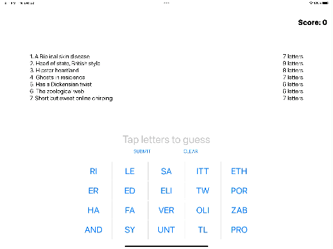
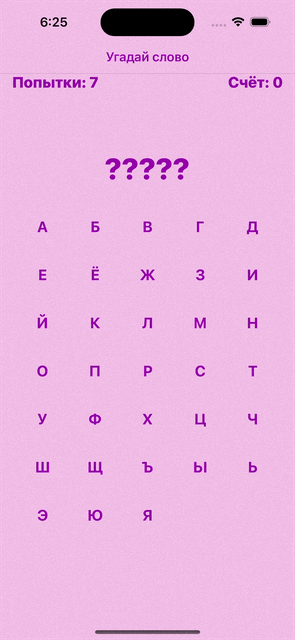

# HWS-UIkit

## [Project 1. Day 16-18](https://github.com/DariiaV/HWS-UIKit/tree/main/Project1)
### What used:
- UITableView
- UIImageView
- NavigationController
- NavigationBar

## [Project 2. Day 19-21](https://github.com/DariiaV/HWS-UIKit/tree/main/Project2)
### What used:
- UIImage
- UIButton
- Layer

## [Challenge 1. Day 23](https://github.com/DariiaV/HWS-UIKit/tree/main/Challenge1)
### What used:
- UITableView
- UIImageView
- NavigationController
- UIBarButtonItem
- NavigationItem.rightBarButtonItem

## [Project 4. Day 24-26](https://github.com/DariiaV/HWS-UIKit/tree/main/Project4)
### What used:
- loadView()
- WKWebView
- URL
- URLRequest
- UIToolbar
- UIProgressView

## [Project 5. Day 27-29](https://github.com/DariiaV/HWS-UIKit/tree/main/Project5)
### What used:
- UITableView
- UIAlertController
- NSRange

## [Project 6a. Day 29](https://github.com/DariiaV/HWS-UIKit/tree/main/Project6a)
## [Project 6b. Day 30-31](https://github.com/DariiaV/HWS-UIKit/tree/main/Project6b)
### What used:
- Auto Layout

## [Challenge 2. Day 32](https://github.com/DariiaV/HWS-UIKit/tree/main/Challenge2)
### What used:
- UITableView
- UIActivityViewController
- NavigationController
- UIBarButtonItem
- UIAlertController

## [Project 7. Day 33-35](https://github.com/DariiaV/HWS-UIKit/tree/main/Project7)
### What used:
- UITabBarController
- UIAlertController
- NavigationController
- JSON
- WKWebView
- UITableView

## [Project 8. Day 36-38](https://github.com/DariiaV/HWS-UIKit/tree/main/Project8)
### What used:
-  enumerated()
-  joined()
-  replacingOccurrences()

## [Challenge 3. Day 41](https://github.com/DariiaV/HWS-UIKit/tree/main/Challenge3)

## [Project 10. Day 42-44](https://github.com/DariiaV/HWS-UIKit/tree/main/Project10)
### What used:
- UICollectionView
- UIImagePickerController
- UUID

## [Project 12a. Day 48](https://github.com/DariiaV/HWS-UIKit/tree/main/Project12a)
## [Project 12b. Day 49](https://github.com/DariiaV/HWS-UIKit/tree/main/Project12b)
### What used:
- NSCoding
- Codable
- UserDefaults

## [Challenge 4. Day 50](https://github.com/DariiaV/HWS-UIKit/tree/main/Challenge4)
### What used:
- Codable
- UserDefaults
- imagePickerController
- trailingSwipeActionsConfigurationForRowAt(tableview)

## [Project 13. Day 52-54](https://github.com/DariiaV/HWS-UIKit/tree/main/Project13)
### What used:
- CIImage
- UIImagePickerController
- CoreImage
- CIFilter
- CIContext
- UIImageWriteToSavedPhotosAlbum

