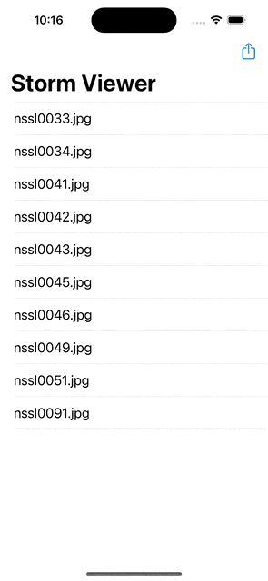

# HWS-UIkit

## [Project 1. Day 16-18](https://github.com/DariiaV/HWS-UIKit/tree/main/Project1)
### What used:
- UITableView
- UIImageView
- NavigationController
- NavigationBar

## [Project 2. Day 19-21](https://github.com/DariiaV/HWS-UIKit/tree/main/Project2)
### What used:
- UIImage
- UIButton
- Layer

## [Challenge 1. Day 23](https://github.com/DariiaV/HWS-UIKit/tree/main/Challenge1)
### What used:
- UITableView
- UIImageView
- NavigationController
- UIBarButtonItem
- NavigationItem.rightBarButtonItem

## [Project 4. Day 24-26](https://github.com/DariiaV/HWS-UIKit/tree/main/Project4)
### What used:
- loadView()
- WKWebView
- URL
- URLRequest
- UIToolbar
- UIProgressView

## [Project 5. Day 27-29](https://github.com/DariiaV/HWS-UIKit/tree/main/Project5)
### What used:
- UITableView
- UIAlertController
- NSRange

